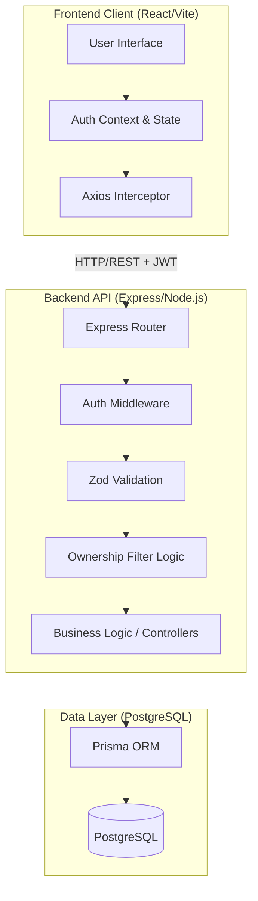

# Architecture

PipelineIQ uses a standard three-tier architecture: a React Single Page Application (SPA), a Node.js/Express RESTful API, and a PostgreSQL relational database.

## Authorization Design Decision

The most critical engineering requirement in PipelineIQ is data isolation between Sales Reps. A rep must never be able to read, modify, or advance a lead or opportunity that belongs to another rep.

### The Enforcement Layer
Authorization is enforced in the **backend query layer**, never on the frontend. 

1. **Authentication**: The `authenticate` middleware verifies the JWT and attaches the `user` object (including their `id` and `role`) to the Express Request.
2. **The Ownership Filter**: For list queries (e.g., `GET /api/leads`), the `getOwnershipFilter(user)` utility generates a Prisma `WHERE` clause dynamically. 
   - If the user is a `SALES_MANAGER`, it returns an empty object `{}` (sees all records).
   - If the user is a `SALES_REP`, it returns `{ assignedTo: user.userId }`.
3. **Record-level Guards**: For targeted actions (`GET /:id`, `PUT /:id`), the record is first fetched. The backend then verifies `if (user.role === 'SALES_REP' && record.assignedTo !== user.userId)`. If this fails, the server aborts the request.

### 403 Forbidden vs 404 Not Found
When a rep hits a direct ID (e.g., `/api/leads/:id`) that they do not own, the system deliberately returns **403 Forbidden**. 
While returning 404 is a common tactic to prevent ID enumeration in public APIs, PipelineIQ is an internal enterprise tool. Returning 403 provides clear, transparent feedback to the frontend and the employee that they have hit an access boundary, preventing confusion over whether a record was deleted or never existed.
