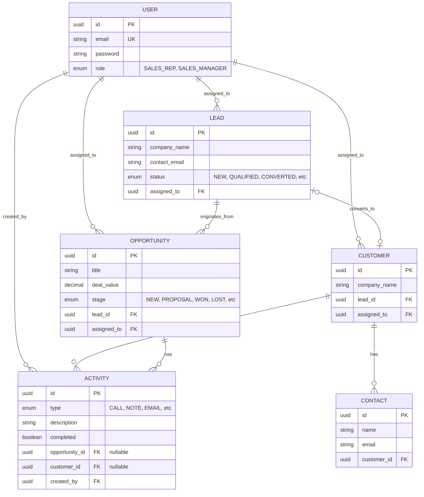

# Database Design

PipelineIQ uses a strictly relational PostgreSQL database schema managed by Prisma ORM.

## Entity Relationship Diagram

## Entity Explanations

*   **User**: Represents internal staff. The `role` enum strictly dictates their permissions across the platform.
*   **Lead**: Pre-sales prospects. They contain initial contact info and track qualification status.
*   **Opportunity**: Actual sales deals. Opportunities are tied to Leads and represent pipeline value. They enforce a strict state machine via the `stage` enum.
*   **Customer**: Created when a Lead is converted. Represents an ongoing business relationship, separated from the initial Lead acquisition data.
*   **Contact**: Individual people associated with a Customer account.
*   **Activity**: A polymorphic-like log of actions (calls, notes, meetings). They can be attached to either an Opportunity or a Customer, and are always tied to the User who created them.

## Indexing Rationale

PostgreSQL handles primary key and unique constraint indexes automatically. We added the following explicit indexes to optimize the specific access patterns of this CRM:

1.  `@@index([assignedTo])` on `Lead`, `Opportunity`, and `Customer`.
    *   **Rationale**: Because of our strict ownership authorization model, literally every `findMany` query a Sales Rep runs filters by `assignedTo = current_user.id`. These indexes are critical for performance as the table grows.
2.  `@@index([stage])` on `Opportunity`.
    *   **Rationale**: The Dashboard relies heavily on aggregating deal values grouped by stage (`GROUP BY stage` equivalent), and the Pipeline board fetches records filtered by stage.
3.  `@@index([status])` on `Lead`.
    *   **Rationale**: Filtering leads by status (e.g., "Show me all QUALIFIED leads") is a primary workflow.
4.  `@@index([dueDate, completed])` on `Activity`.
    *   **Rationale**: Supports the dashboard query that identifies pending follow-ups due today efficiently.
